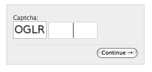
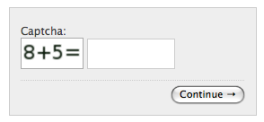
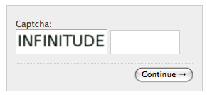

Advanced topics
===============

Configuration toggles
+++++++++++++++++++++

The following configuration elements can be defined (in your ``settings.py``)

CAPTCHA_FONT_PATH
-----------------

Full path and filename of a TrueType (TTF), OpenType, or pilfont font file used to render text.

Defaults to: ``fonts/Vera.ttf`` (included in the application, GPL font).

Note that your PIL installation must support TTF and/or OpenFont if you want to use these kind of glyphs (most modern distributions of PIL do.)

Note: as of version 0.4.6, ``CAPTCHA_FONT_PATH`` may be an iterable of font paths, in which case a font will be picked randomly from the list for each CAPTCHA.

CAPTCHA_FONT_SIZE
-----------------

Font-size in pixels of the rendered text.

Defaults to '22'.

CAPTCHA_IMAGE_SIZE
------------------

Image size in pixels of generated captcha, specified by 2-tuple (width, height)

Defaults to `None` (automatically calculated)

CAPTCHA_LETTER_ROTATION
-----------------------

A random rotation in this interval is applied to each letter in the challenge text.

Defaults to ``(-35,35)``.

New in version 0.1.6: set this to None to disable letter roation.

CAPTCHA_BACKGROUND_COLOR
------------------------

Background-color of the captcha. Can be expressed as html-style #rrggbb, rgb(red, green, blue), or common html names (e.g. "red").

Defaults to: ``'#ffffff'``

CAPTCHA_FOREGROUND_COLOR
------------------------

Foreground-color of the captcha.

Defaults to ``'#001100'``

CAPTCHA_CHALLENGE_FUNCT
------------------------

String representing a python callable (i.e. a function) to use as challenge generator.

See Generators below for a list of available generators and a guide on how to write your own.

Defaults to: ``'captcha.helpers.random_char_challenge'``

CAPTCHA_MATH_CHALLENGE_OPERATOR
-------------------------------

When using the ``math_challenge``, lets you choose the multiplication operator. Use lowercase ``'x'`` for cross sign.

Defaults to: ``'*'`` (asterisk sign)

CAPTCHA_NOISE_FUNCTIONS
------------------------

List of strings of python callables that take a PIL ``DrawImage`` object and an ``Image`` image as input, modify the ``DrawImage``, then return it.

Defaults to: ``('captcha.helpers.noise_arcs','captcha.helpers.noise_dots',)``

A null noise helper function useful when debugging issues is available at ``'captcha.helpers.noise_null'``.

CAPTCHA_FILTER_FUNCTIONS
------------------------

List of strings of python callables that take a PIL ``Image`` object as input, modify it and return it.

These are called right before the rendering, i.e. after the noise functions.

Defaults to: ``('captcha.helpers.post_smooth',)``

CAPTCHA_WORDS_DICTIONARY
------------------------

Required for the ``word_challenge`` challenge function only. Points a file containing a list of words, one per line.

Defaults to: ``'/usr/share/dict/words'``

CAPTCHA_FLITE_PATH
------------------------

Full path to the ``flite`` executable. When defined, will automatically add audio output to the captcha.

Defaults to: ``None`` (no audio output)

CAPTCHA_SOX_PATH
------------------------

Full path to the ``sox`` executable. If audio output is enabled via ``CAPTCHA_FLITE_PATH``, the generated output audio file is identical across multiple generations (unlike CAPTCHA images which get different random noise each time they are rendered). User appleorange1_ has shown_ that this could be used to pre-generate a "rainbow-table" of all possible input strings and a hash of the generated output soundfile, thus rendering an attack on audio CAPTCHAs trivial.

If sox_ is installed and used via this settings, random brown noise is injected into the generated audio file, rendering attacks via a rainbow table impossible.

Defaults to: ``None`` (no audio output)

.. _appleorange1: https://github.com/appleorange1
.. _shown: https://github.com/appleorange1/django-simple-captcha-cracker-poc
.. _sox: http://sox.sourceforge.net/

CAPTCHA_TIMEOUT
---------------

Integer. Lifespan, in minutes, of the generated captcha.

Defaults to: 5

CAPTCHA_LENGTH
------------------------

Sets the length, in chars, of the generated captcha. (for the ``'captcha.helpers.random_char_challenge'`` challenge)

Defaults to: 4

CAPTCHA_DICTIONARY_MIN_LENGTH
-----------------------------

When using the word_challenge challenge function, controls the minimum length of the words to be randomly picked from the dictionary file.

Defaults to: 0

CAPTCHA_DICTIONARY_MAX_LENGTH
-----------------------------

When using the word_challenge challenge function, controls the maximal length of the words to be randomly picked from the dictionary file.

Defaults to: 99

Note: it's perfectly safe to specify e.g. ``CAPTCHA_DICTIONARY_MIN_LENGTH = CAPTCHA_DICTIONARY_MAX_LENGTH = 6`` but it's considered an error to define ``CAPTCHA_DICTIONARY_MAX_LENGTH`` to be smaller than ``CAPTCHA_DICTIONARY_MIN_LENGTH``.

.. _output_format_ref:

CAPTCHA_OUTPUT_FORMAT
------------------------

New in version 0.1.6

Specify your own output format for the generated markup, when e.g. you want to position the captcha image relative to the text field in your form.

Defaults to: ``None``

(Used to default to: ``u'%(image)s %(hidden_field)s %(text_field)s'``)

.. warning:: This setting is deprecated in favor of template-based widget rendering (see the Rendering section below).

CAPTCHA_TEST_MODE
------------------------

New in version 0.3.6

When set to True, the string "PASSED" (any case) will be accepted as a valid response to any CAPTCHA.
Use this for testing purposes. Warning: do NOT set this to True in production.

Defaults to: False

CAPTCHA_GET_FROM_POOL
---------------------

By default, `django-simple-captcha` generates a new captcha when needed and stores it in the database. This occurs in a `HTTP GET request`, which may not be wished. This default behavior may also conflict with a load balanced infrastructure, where there is more than one database to read data from. If this setting is `True`, when a new captcha is needed, a random one will be just read from a pool of captchas saved previously in the database. In this case, the custom management command `captcha_create_pool` must be run regularly in intervals slightly shorter than `CAPTCHA_TIMEOUT`. A good value for `CAPTCHA_TIMEOUT` could be 1446 (24 hours and 6 minutes) when adding captchas to the pool every 24 hours, and setting `CAPTCHA_GET_FROM_POOL_TIMEOUT` (see below) to 5 minutes. This means that 6 minutes before the last captchas expires, new captchas will be created, and no captcha will be used whose expiration is less than 5 minutes. In this case, use a cronjob or similar to run `python manage.py captcha_create_pool` every 24 hours.

Defaults to: False

CAPTCHA_GET_FROM_POOL_TIMEOUT
-----------------------------

This is a timeout value in minutes used only if `CAPTCHA_GET_FROM_POOL` (see above) is `True`. When picking up randomly from the pool, this setting will prevent to pick up a captcha that expires sooner than `CAPTCHA_GET_FROM_POOL_TIMEOUT`.

Defaults to: 5

Rendering
+++++++++

``CaptchaTextInput`` supports the widget rendering using template introduced in Django 1.11.
To change the output HTML, change the ``template_name`` to a custom template or modify ``get_context`` method to provide further context.
See https://docs.djangoproject.com/en/dev/ref/forms/renderers/ for description of rendering API.
Keep in mind that ``CaptchaTextInput`` is a subclass of ``MultiWidget`` which affects the context, see https://docs.djangoproject.com/en/2.0/ref/forms/widgets/#multiwidget.

For example, you would::

    class CustomCaptchaTextInput(CaptchaTextInput):
        template_name = 'custom_field.html'

    class CaptchaForm(forms.Form):
        captcha = CaptchaField(widget=CustomCaptchaTextInput)

And then have a ``custom_field.html`` template::

    
    
    

      <label class="control-label">{{ label }}</label>
      

        

          

            
                <a title="" href="{{ audio }}">
            
            
          

          
        

      

    

    

.. note:: For this to work, you MUST
   add ``django.forms`` to your ``INSTALLED_APPS`` and
   set ``FORM_RENDERER = 'django.forms.renderers.TemplatesSetting'`` to your settings.py.
   (See here_ for an explanation)

.. _here: https://docs.djangoproject.com/en/2.0/ref/forms/renderers/#django.forms.renderers.TemplatesSetting

.. warning:: To provide backwards compatibility, the old style rendering has priority over the widget templates.
   If the ``CAPTCHA_FIELD_TEMPLATE`` or ``CAPTCHA_OUTPUT_FORMAT`` settings or ``field_templates`` or ``output_format`` parameter are set, the direct rendering gets higher priority.
   If widget templates are ignored, make sure you're using Django >= 1.11 and disable these settings and parameters.

Old style rendering
-------------------

.. warning:: This rendering method is deprecated. Use Django >= 1.11 and widgets templates instead.

A CAPTCHA field is made up of three components:

* The actual image that the end user has to copy from
* A text field, that the user has to fill with the content of the image
* A hidden field, containing the database reference of the CAPTCHA (for verification).

These three elements are rendered individually, then assembled into a single bit of HTML.

As of version 0.4.7 you can control how the individual components are rendered, as well as how all components are assembled, by overriding four templates:

* ``captcha/image.html`` controls the rendering of the image (and optionnally audio) element
* ``captcha/text_field.html`` controls the rendering of the text field
* ``captcha/hidden_field.html`` controls the rendering of the hidden input
* ``captcha/field.html`` controls the assembling of the previous three elements

These templates can be overriden in your own ``templates`` folder, or you can change the actual template names by settings ``CAPTCHA_IMAGE_TEMPLATE``, ``CAPTCHA_TEXT_FIELD_TEMPLATE``, ``CAPTCHA_HIDDEN_FIELD_TEMPLATE`` and ``CAPTCHA_FIELD_TEMPLATE``, respectively.

Context
~~~~~~~

The following context variables are passed to the three "individual" templates:

* ``image``: The URL of the rendered CAPTCHA image
* ``name``: name of the field (i.e. the name of your form field)
* ``key``: the hashed value (identifier) of this CAPTCHA: this is stored and passed in the hidden input
* ``id``: the HTML ``id`` attribute to be used

The ``captcha/field.html`` template receives the following context:

* ``image``: the rendered (HTML) image and optionnaly audio elements
* ``hidden_field``: the rendered hidden input
* ``text_field``: the rendered text input

Note: these elements have been marked as safe, you can render them straight into your template.

.. _generators_ref:

Generators and modifiers
++++++++++++++++++++++++

Random chars
------------

Classic captcha that picks four random chars. This is case insensitive. ::

    CAPTCHA_CHALLENGE_FUNCT = 'captcha.helpers.random_char_challenge'

Simple Math
------------

Another classic, that challenges the user to resolve a simple math challenge by randomly picking two numbers between one and nine, and a random operator among plus, minus, times. ::

    CAPTCHA_CHALLENGE_FUNCT = 'captcha.helpers.math_challenge'

Dictionary Word
----------------

Picks a random word from a dictionary file. Note, you must define ``CAPTCHA_WORDS_DICTIONARY`` in your cofiguration to use this generator. ::

    CAPTCHA_CHALLENGE_FUNCT = 'captcha.helpers.word_challenge'

Roll your own
-------------

To have your own challenge generator, simply point ``CAPTCHA_CHALLENGE_FUNCT`` to a function that returns a tuple of strings: the first one (the challenge) will be rendered in the captcha, the second is the valid response to the challenge, e.g. ``('5+10=', '15')``, ``('AAAA', 'aaaa')``

This sample generator that returns six random digits::

    import random

    def random_digit_challenge():
        ret = u''
        for i in range(6):
            ret += str(random.randint(0,9))
        return ret, ret

