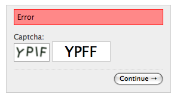

*********************
Django Simple Captcha
*********************

.. image:: https://travis-ci.org/mbi/django-simple-captcha.png?branch=master

Django Simple Captcha is an extremely simple, yet highly customizable Django application to add captcha images to any Django form.

Features
++++++++

* Very simple to setup and deploy, yet very configurable
* Can use custom challenges (e.g. random chars, simple maths, dictionary word, ...)
* Custom generators, noise and filter functions alter the look of the generated image
* Supports text-to-speech audio output of the challenge text, for improved accessibility
* Ajax refresh

Requirements
++++++++++++

* Django 1.8+
* A recent version of Pillow compiled with FreeType support
* Flite is required for text-to-speech (audio) output, but not mandatory

Python 3 compatibility
++++++++++++++++++++++

The current development version supports Python3 via the `six <https://pypi.python.org/pypi/six>`_ compatibility layer.

******************
Contents:
******************

.. toctree::
   :maxdepth: 2

   usage.rst
   advanced.rst
   changes.rst
